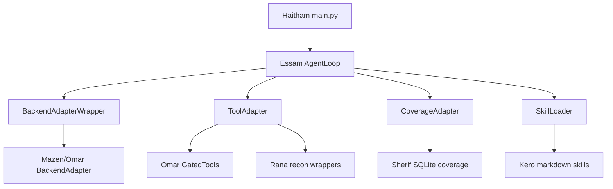

# Architecture

## System Purpose

The AI Recon Agent is a modular reconnaissance orchestration system. Haitham's layer connects all teammate deliverables into one executable workflow.

## Component Map



## Responsibility Split

### Kero → Skills

- Markdown playbooks in `kero/`
- Loaded recursively by `Haitham/integration/skill_loader.py`
- Injected into AgentLoop context

### Rana → Tools

- Recon wrapper functions (`run_subfinder`, `run_httpx`, etc.)
- Mapped in `Haitham/integration/tool_adapter.py`
- Routed through permission gate before execution

### Sherif → Coverage

- SQLite tracker in `sherif/coverage.py`
- Wrapped by `Haitham/integration/coverage_adapter.py`
- Tracks tested loop steps and scan snapshots

### Omar/Mazen → Execution + Backend

- Permission gate and gated tools (`omar/tools.py`)
- Backend adapter (`mazen/adapter.py`, with fallback discovery)
- Unified by Haitham adapters

### Essam → Agent Loop

- `Essam/agent_loop.py` orchestrates plan/act/observe/verify/report
- Consumes adapters through stable interfaces

### Haitham → Integration

- Startup, config, logging, demo runner, docs
- No teammate source modifications

## Runtime Sequence

```text
startup
  -> load config/env
  -> initialize logging
  -> load skills
  -> initialize adapters
  -> run AgentLoop(goal)
  -> persist artifacts
shutdown
```

## Data Flow

```text
demo_target.md
  -> AgentLoop goal
  -> skills context (Kero)
  -> model planning (backend)
  -> tool execution (Rana/Omar via ToolAdapter)
  -> coverage updates (Sherif)
  -> final report + JSON artifacts
```

## Design Principles

- Adapter-first integration (preserve teammate code)
- Fail-safe error handling in adapters
- Explicit offline demo mode for reproducible classroom runs
- Artifact-driven validation (JSON + logs + SQLite)
